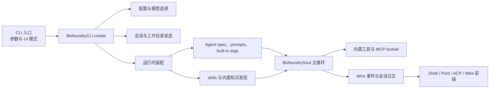

# Biofoundry_CLI

中文 | [English](./README.en.md)

Biofoundry_CLI 是一个面向生物制造与合成生物学场景的终端优先型软件工程 Agent。它以大语言模型为决策核心，能够在获得用户授权后自主调用工具完成复杂任务：读取和编辑代码、执行 shell 命令、检索网络信息、接入 MCP 服务器，并支持交互式 shell、print、ACP 和 wire 多种运行模式。

## 快速开始

```sh
mkdir -p .biofoundry
cp config.example.toml .biofoundry/config.toml
export OPENAI_API_KEY="sk-..."
make prepare
uv run biofoundry
```

## 在其它工作目录中使用

Biofoundry_CLI 可以安装在本仓库，但操作另一个项目目录。

推荐用法：

1. 先进入目标项目目录，再从本仓库启动：

```sh
cd /path/to/target-project
uv run --project /path/to/RhlA_Agent_CLI biofoundry
```

2. 保持当前 shell 位置不变，显式指定目标目录：

```sh
uv run \
  --directory /path/to/target-project \
  --project /path/to/RhlA_Agent_CLI \
  biofoundry
```

配置与会话存储规则：

- 默认把运行时状态放在启动时检测到的项目根目录下的 `.biofoundry/`。
- 上面两种用法意味着 `.biofoundry/` 和 `config.toml` 都落在 `/path/to/target-project` 下。
- `--work-dir` 只改变 agent 工作区，不会单独移动默认配置或会话存储位置。
- 如需固定路径，使用 `--config-file /path/to/config.toml` 和/或 `BIOFOUNDRY_SHARE_DIR=/path/to/.biofoundry`。

显式覆盖工作区示例：

```sh
uv run --project /path/to/RhlA_Agent_CLI \
  biofoundry \
  --work-dir /path/to/target-project \
  --config-file /path/to/target-project/.biofoundry/config.toml
```

## 配置

Biofoundry_CLI 默认使用启动项目根目录下的 `.biofoundry/config.toml`。模板见 [`config.example.toml`](./config.example.toml)。

启动前该文件必须已存在，CLI 不会自动创建。

默认同时保留两条 OpenAI SDK 路径：

- `openai_responses`
- `openai_legacy`

环境变量示例：

```sh
export OPENAI_API_KEY="sk-..."
export OPENAI_BASE_URL="https://api.openai.com/v1"
export OPENAI_MODEL_NAME="gpt-5"
uv run biofoundry
```

配置文件示例：

```toml
default_model = "openai-responses"
default_thinking = false

[models.openai-responses]
provider = "openai-responses"
model = "gpt-5"
max_context_size = 100000

[models.openai-legacy]
provider = "openai-legacy"
model = "gpt-4o"
max_context_size = 100000

[providers.openai-responses]
type = "openai_responses"
base_url = "https://api.openai.com/v1"
api_key = ""

[providers.openai-legacy]
type = "openai_legacy"
base_url = "https://api.openai.com/v1"
api_key = ""
```

说明：

- 当通过环境变量提供 `OPENAI_API_KEY` 时，`api_key = ""` 是合法的。
- `OPENAI_MODEL_NAME` 会在运行时覆盖当前选中的模型名。
- shell 模式中可用 `/model` 切换已配置模型。
- CLI 不再内置 `/login` 或账号登录流程。

## Agent 能力

Biofoundry_CLI 的 Agent 能力围绕「理解任务 → 规划步骤 → 调用工具 → 反馈结果」的闭环展开：

- **自主任务执行**：在 shell 模式下，用户用自然语言描述目标后，Agent 会自行拆解步骤、选择工具并执行，必要时向用户确认关键操作（如写文件、执行高风险命令）。
- **代码工程**：读取、搜索、创建和修改项目中的文本文件；支持 Diff 审查、批量替换和代码片段级编辑。
- **Shell 与系统交互**：在受控环境中运行 shell 命令，解析输出并据此决定下一步动作。
- **信息检索**：通过内置 Web 搜索和 URL 抓取获取最新资料，辅助文献调研、API 文档查询等。
- **MCP 生态**：可接入外部 MCP server 扩展工具集；同时内置 `biofoundry synpan-mcp` stdio MCP 服务，默认自动加载，可用 `--no-synpan-mcp` 关闭。
- **多模式运行**：
  - `shell`：交互式对话，适合迭代式开发。
  - `print`：非交互式，直接输出结果，适合脚本化调用。
  - `ACP`：Agent Client Protocol 模式，供外部客户端调用。
  - `wire`：面向 UI 集成的流式事件模式。
- **规划与子代理**：支持进入 plan 模式对复杂任务做分步设计，也能委派子代理处理专项任务。
- **Skills 与领域知识**：自动发现 `Knowledge/` 和本地 skills 目录中的能力包；随附生物制造相关的数据分析、协议解析、序列处理等 skills。
- **会话持久化**：运行状态、上下文和历史记录保存在 `.biofoundry/` 中，支持跨会话恢复。

### 生物制造专项能力

- **Sanger 测序分析**：`biofoundry_cli.tools.sanger.SangerAlign` 用于序列比对、差异识别和预期突变校验。
- **SynPan 设备驱动与平台接入**：统一在 `biofoundry_cli.synpan` 下，同时支持 CIAI 设备端点（`/Info`、`/Function`、`/Set` 等）和第三方工艺平台端点（workcell、craft、materiel、data、order），可用于实验设备控制与工艺订单管理。

## 常用命令

```sh
biofoundry --help
biofoundry --version
biofoundry --work-dir /path/to/project
biofoundry acp
biofoundry mcp list
biofoundry --mcp-config-file /path/to/mcp.json
biofoundry synpan-mcp   # 统一 SynPan MCP server
```

## 架构概览



- CLI 层解析 `--work-dir`、`--config-file`、UI 模式、MCP 配置和会话控制等参数。
- `BiofoundryCLI.create` 加载配置、解析模型与 provider、恢复会话上下文并构建运行时。
- 运行时装配注入工作目录、`AGENTS.md`、已发现 skills、内置知识、审批状态和子代理状态。
- `BiofoundrySoul` 是主编排循环：接收输入、调用 LLM、执行工具、处理审批、发出 wire 消息。
- 工具执行支持内置 toolset 与可选 MCP 服务器。
- 四类前端共享同一条 wire/event 流，会话元数据与历史持久化到 `.biofoundry/`。

## 核心模块

- `src/biofoundry_cli/cli/`：CLI 参数、子命令与 UI 模式选择。
- `src/biofoundry_cli/app.py`：顶层应用构建与运行时启动。
- `src/biofoundry_cli/soul/`：主 agent 循环、运行时状态、审批、上下文和压缩。
- `src/biofoundry_cli/tools/`：内置 shell、file、web、plan、multiagent、sanger 等工具。
- `src/biofoundry_cli/ui/`：shell、print、ACP 前端。
- `src/biofoundry_cli/wire/`：soul 与 UI 之间的事件协议和流传输。
- `src/biofoundry_cli/synpan/`：统一的 SynPan CIAI 设备驱动与第三方工艺平台适配。
- `Knowledge/`：内置领域知识与打包随附的 Biofoundry skills。

## SynPan MCP 适配

`biofoundry synpan-mcp` 启动一个统一的 stdio MCP server，同时暴露两类工具：

- **CIAI 设备端点**：`synpan_get_info`、`synpan_run_function`、`synpan_set_parameters` 等。
- **第三方工艺平台**：`getWorkCellList`、`getCraftList`、`createOrder`、`operateOrder` 等。

环境变量：

- CIAI 驱动：`SYNPAN_BASE_URL`、`SYNPAN_TOKEN`、`SYNPAN_TIMEOUT_SECONDS` 等。
- 第三方平台：`SYNPAN_PLATFORM_BASE_URL`、`SYNPAN_PLATFORM_TOKEN`、`SYNPAN_PLATFORM_TIMEOUT_MS`；旧版 `XINGPAN_*` 仍作为兼容 fallback。

详见 [`docs/synpan-mcp.md`](./docs/synpan-mcp.md)。

## 开发

```sh
make prepare
make format
make check
make test
make build
make build-bin
```

## 备注

- 默认 CLI 命令为 `biofoundry`。
- ACP 客户端应调用 `biofoundry acp`。
- 本 README 为中文版；英文版见 [`README.en.md`](./README.en.md)。
