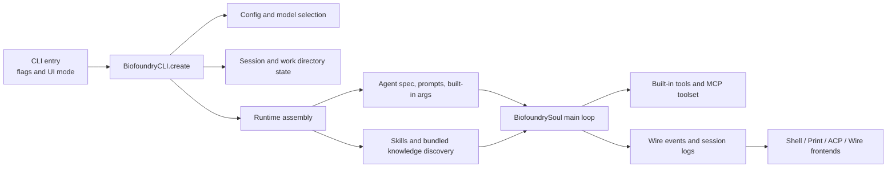

# Biofoundry_CLI

English | [中文](./README_zh.md)

Biofoundry_CLI is a terminal-first software engineering agent. It can read and edit code, run shell commands, work with MCP servers, and operate in interactive shell, print, ACP, and wire modes.

## Quick Start

```sh
mkdir -p .biofoundry
cp config.example.toml .biofoundry/config.toml
export OPENAI_API_KEY="sk-..."
make prepare
uv run biofoundry
```

## Use Biofoundry_CLI From Another Working Directory

Biofoundry_CLI can be executed from this repository while operating on a different project directory.

Recommended workflows:

1. Change into the target project directory first, then run Biofoundry_CLI from this repo:

```sh
cd /path/to/target-project
uv run --project /path/to/RhlA_Agent_CLI biofoundry
```

2. Keep your current shell where it is and ask `uv` to launch from the target project directory:

```sh
uv run \
  --directory /path/to/target-project \
  --project /path/to/RhlA_Agent_CLI \
  biofoundry
```

How config and session storage work:

- By default, Biofoundry_CLI stores runtime state under `.biofoundry/` in the detected startup project root.
- In the two workflows above, that means `.biofoundry/` and `config.toml` live under `/path/to/target-project`.
- `--work-dir` changes the agent's workspace, but it does not move the default config or session storage location by itself.
- If you need to pin those paths explicitly, use `--config-file /path/to/config.toml` and/or set `BIOFOUNDRY_SHARE_DIR=/path/to/.biofoundry`.

Example of an explicit workspace override:

```sh
uv run --project /path/to/RhlA_Agent_CLI \
  biofoundry \
  --work-dir /path/to/target-project \
  --config-file /path/to/target-project/.biofoundry/config.toml
```

## Configuration

Biofoundry_CLI uses `.biofoundry/config.toml` in the startup project root as its runtime config file. A ready-to-edit example is included at [`config.example.toml`](./config.example.toml).

The CLI requires this file to exist before startup and does not auto-create it.

The default setup keeps both OpenAI SDK paths available:

- `openai_responses`
- `openai_legacy`

Example environment setup:

```sh
export OPENAI_API_KEY="sk-..."
export OPENAI_BASE_URL="https://api.openai.com/v1"
export OPENAI_MODEL_NAME="gpt-5"
uv run biofoundry
```

Example config:

```toml
default_model = "openai-responses"
default_thinking = false

[models.openai-responses]
provider = "openai-responses"
model = "gpt-5"
max_context_size = 100000

[models.openai-legacy]
provider = "openai-legacy"
model = "gpt-4o"
max_context_size = 100000

[providers.openai-responses]
type = "openai_responses"
base_url = "https://api.openai.com/v1"
api_key = ""

[providers.openai-legacy]
type = "openai_legacy"
base_url = "https://api.openai.com/v1"
api_key = ""
```

Notes:

- `api_key = ""` is valid when `OPENAI_API_KEY` is provided via environment variables.
- `OPENAI_MODEL_NAME` overrides the selected model name at runtime.
- Use `/model` in shell mode to switch between configured models.
- The CLI no longer includes a built-in `/login` or account login flow.

## Common Commands

```sh
biofoundry --help
biofoundry --version
biofoundry --work-dir /path/to/project
biofoundry acp
biofoundry mcp list
biofoundry --mcp-config-file /path/to/mcp.json
```

## Architecture Overview



- The CLI layer parses flags such as `--work-dir`, `--config-file`, UI mode selection, MCP config, and session controls.
- `BiofoundryCLI.create` loads configuration, resolves the model/provider, restores the session context, and builds the runtime.
- Runtime assembly injects the working directory, `AGENTS.md`, discovered skills, bundled knowledge, approvals, and subagent state into the loaded agent.
- `BiofoundrySoul` is the main orchestration loop: it accepts user input, calls the LLM, executes tools, handles approvals, and emits wire messages.
- Tool execution goes through the built-in toolset and optional MCP servers.
- Shell, print, ACP, and wire frontends all consume the same wire/event stream, while session metadata and history are persisted under `.biofoundry/`.

## Core Modules

- `src/biofoundry_cli/cli/`: CLI flags, subcommands, and UI mode selection.
- `src/biofoundry_cli/app.py`: top-level app construction and runtime bootstrap.
- `src/biofoundry_cli/soul/`: main agent loop, runtime state, approvals, context, and compaction.
- `src/biofoundry_cli/tools/`: built-in shell, file, web, planning, and multiagent tools.
- `src/biofoundry_cli/ui/`: shell, print, and ACP frontends.
- `src/biofoundry_cli/wire/`: event protocol and streaming transport between soul and UI.
- `Knowledge/`: bundled domain knowledge and packaged Biofoundry skills.

## Development

```sh
make prepare
make format
make check
make test
make build
make build-bin
```

## Notes

- The default CLI command is `biofoundry`.
- ACP clients should invoke `biofoundry acp`.
- The package metadata continues to use this English README as the default project readme.
