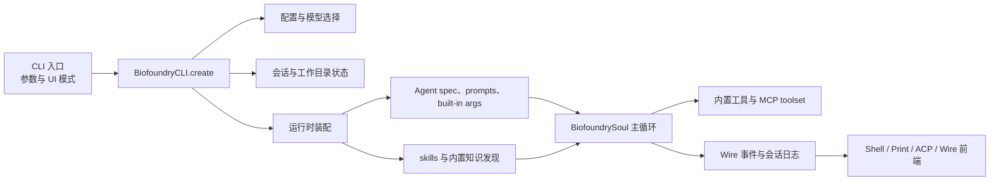

# Biofoundry_CLI

[English](./README.md) | 中文

Biofoundry_CLI 是一个以终端为中心的软件工程代理。它可以读取和编辑代码、执行 shell 命令、接入 MCP 服务器，并支持交互式 shell、print、ACP 和 wire 模式。

## 快速开始

```sh
mkdir -p .biofoundry
cp config.example.toml .biofoundry/config.toml
export OPENAI_API_KEY="sk-..."
make prepare
uv run biofoundry
```

## 在其他工作目录中使用 Biofoundry_CLI

你可以从当前仓库启动 Biofoundry_CLI，同时让它在另一个项目目录上工作。

推荐的两种方式：

1. 先切换到目标项目目录，再从本仓库运行 Biofoundry_CLI：

```sh
cd /path/to/target-project
uv run --project /path/to/RhlA_Agent_CLI biofoundry
```

2. 保持当前 shell 目录不变，通过 `uv` 显式指定目标项目目录作为启动目录：

```sh
uv run \
  --directory /path/to/target-project \
  --project /path/to/RhlA_Agent_CLI \
  biofoundry
```

配置和会话目录的规则：

- 默认情况下，Biofoundry_CLI 会把运行时状态存放在启动时检测到的项目根目录下的 `.biofoundry/`。
- 对于上面两种方式，这意味着 `.biofoundry/` 和 `config.toml` 都会落在 `/path/to/target-project` 下。
- `--work-dir` 只会改变 agent 的工作区，不会单独改变默认配置或会话存储位置。
- 如果你需要显式固定这些路径，可以使用 `--config-file /path/to/config.toml`，以及/或者设置 `BIOFOUNDRY_SHARE_DIR=/path/to/.biofoundry`。

显式指定工作区的示例：

```sh
uv run --project /path/to/RhlA_Agent_CLI \
  biofoundry \
  --work-dir /path/to/target-project \
  --config-file /path/to/target-project/.biofoundry/config.toml
```

## 配置

Biofoundry_CLI 默认使用启动项目根目录下的 `.biofoundry/config.toml` 作为运行配置文件。你可以直接从 [`config.example.toml`](./config.example.toml) 复制并修改。

CLI 在启动前要求该文件已经存在，不会自动创建。

默认配置同时保留两条 OpenAI SDK 路径：

- `openai_responses`
- `openai_legacy`

环境变量示例：

```sh
export OPENAI_API_KEY="sk-..."
export OPENAI_BASE_URL="https://api.openai.com/v1"
export OPENAI_MODEL_NAME="gpt-5"
uv run biofoundry
```

配置文件示例：

```toml
default_model = "openai-responses"
default_thinking = false

[models.openai-responses]
provider = "openai-responses"
model = "gpt-5"
max_context_size = 100000

[models.openai-legacy]
provider = "openai-legacy"
model = "gpt-4o"
max_context_size = 100000

[providers.openai-responses]
type = "openai_responses"
base_url = "https://api.openai.com/v1"
api_key = ""

[providers.openai-legacy]
type = "openai_legacy"
base_url = "https://api.openai.com/v1"
api_key = ""
```

说明：

- 当通过环境变量提供 `OPENAI_API_KEY` 时，`api_key = ""` 是合法的。
- `OPENAI_MODEL_NAME` 会在运行时覆盖当前选中的模型名。
- 在 shell 模式中可以使用 `/model` 在已配置模型之间切换。
- CLI 已不再内置 `/login` 或账号登录流程。

## 常用命令

```sh
biofoundry --help
biofoundry --version
biofoundry --work-dir /path/to/project
biofoundry acp
biofoundry mcp list
biofoundry --mcp-config-file /path/to/mcp.json
```

## 架构概览



- CLI 层负责解析 `--work-dir`、`--config-file`、UI 模式、MCP 配置和会话控制等参数。
- `BiofoundryCLI.create` 会加载配置、解析模型与 provider、恢复会话上下文，并构建运行时对象。
- 运行时装配会把工作目录、`AGENTS.md`、已发现的 skills、内置知识、审批状态和子代理状态注入 agent。
- `BiofoundrySoul` 是主编排循环，负责接收用户输入、调用 LLM、执行工具、处理审批，并发出 wire 消息。
- 工具执行同时支持内置 toolset 和可选的 MCP 服务器。
- shell、print、ACP 和 wire 四类前端共享同一条 wire/event 流，而会话元数据和历史记录会持久化到 `.biofoundry/` 下。

## 核心模块

- `src/biofoundry_cli/cli/`：CLI 参数、子命令和 UI 模式选择。
- `src/biofoundry_cli/app.py`：顶层应用构建与运行时启动。
- `src/biofoundry_cli/soul/`：主 agent 循环、运行时状态、审批、上下文和压缩逻辑。
- `src/biofoundry_cli/tools/`：内置 shell、file、web、plan 和 multiagent 工具。
- `src/biofoundry_cli/ui/`：shell、print 和 ACP 前端。
- `src/biofoundry_cli/wire/`：soul 与 UI 之间的事件协议和流式传输层。
- `Knowledge/`：内置领域知识和打包随附的 Biofoundry skills。

## 开发

```sh
make prepare
make format
make check
make test
make build
make build-bin
```

## 备注

- 默认 CLI 命令为 `biofoundry`。
- ACP 客户端应调用 `biofoundry acp`。
- 项目打包元数据仍然使用英文版 README 作为默认项目说明。
